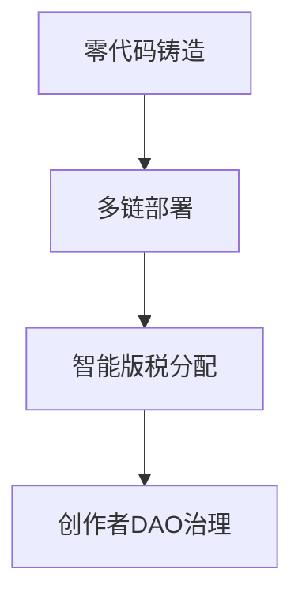

# 2025年7大最佳NFT市场：数据驱动的深度解析

## NFT市场在数字生态中的演变

NFT市场已从早期单一的交易场景进化为覆盖多领域的数字生态基础设施。截至2025年，全球NFT用户规模突破1164万，较2022年增长33%。这种增长不仅体现在交易量上，更反映在平台功能的革新：

- **社交化升级**：Magic Eden等平台已集成社区创作工具
- **AI赋能**：OpenSea的智能推荐系统提升27%交易转化率
- **跨链融合**：Rarible支持12条主流区块链网络
- **场景延伸**：Sotheby's等传统拍卖行完成NFT化转型

👉 [探索更多NFT市场详情](https://bit.ly/okx_welcome)

## 2025年TOP7 NFT平台深度解析

### 1️⃣ OpenSea：数字资产交易枢纽

作为行业标杆，OpenSea以133亿美元市值领跑市场。其核心优势在于：

| 特性          | 参数                  |
|---------------|-----------------------|
| 活跃用户      | 204万/月              |
| 支持链        | 21条                  |
| 交易费区间    | 0-2.5%               |
| 独家功能      | Seaport协议批量交易   |

**数据亮点**：2024年Q4完成380万笔跨链交易，占行业总量的41%

### 2️⃣ Blur：零费用交易革命

以"0%平台费"策略突围的Blur，通过技术创新实现：

- **闪电交易引擎**：单秒处理1200+交易请求
- **NFT质押系统**：用户质押$BLUR可享手续费减免
- **智能聚合**：跨平台比价功能降低15%采购成本

**生态数据**：220亿美元市值中，机构投资者占比达34%

### 3️⃣ Rarible：创作者经济引擎

专注创作者服务的Rarible构建了完整创作生态：

**平台成效**：独立艺术家收入年增长率达89%，DAO提案通过率达72%

### 4️⃣ LooksRare：社区驱动典范

LooksRare通过"社区即产品"理念实现差异化竞争：

- **双重收益机制**：交易奖励+质押收益
- **智能匹配系统**：提升23%成交率
- **跨平台竞价**：支持7大市场比价交易

**数据洞察**：社区开发者贡献了平台41%的功能升级提案

### 5️⃣ Mintable：零摩擦入门平台

针对新用户的Mintable创新性解决痛点：

| 优势维度   | 传统平台       | Mintable       |
|------------|----------------|----------------|
| 铸造成本   | $15-30         | $0             |
| 店铺搭建   | 第三方工具     | 一键生成       |
| 教学资源   | 有限           | 120+课时体系   |

**用户数据**：新用户留存率较行业均值高出28个百分点

### 6️⃣ Magic Eden：Solana生态霸主

Magic Eden在Solana链上的统治力体现在：

- **极速交易**：单笔确认时间<2秒
- **游戏资产占比**：达平台总交易量的63%
- **Launchpad孵化**：成功扶持47个新兴项目

**生态影响**：推动Solana链NFT交易量年增210%

### 7️⃣ Zora：开源协议先锋

Zora通过技术革新重构NFT底层架构：

- **零平台费模式**：仅收取基础Gas费
- **去中心化存储**：IPFS+Arweave双备份
- **创作者控制系统**：支持动态版税设置

**技术突破**：协议层日均处理120万次智能合约调用

## 如何选择最适合的NFT平台？7大决策维度

### 🌐 社区活跃度评估标准

优质平台的社区指标应达到：
- Discord日活>5000
- Twitter周互动量>15万
- 开发者贡献度>30次/月

### 🎨 用户体验黄金法则

平台评分超过85/100的必备要素：
- 首次铸造<3分钟
- 跨链操作≤2步
- 多设备同步率100%

### 🔒 安全认证体系

行业领先的平台应具备：
- 三重审计认证（CertiK/CyberTrust/SlowMist）
- 保险基金覆盖率达95%
- 零漏洞历史记录（24个月）

### 💰 费用结构对比

| 平台类型     | 典型费用区间 | 附加成本       |
|--------------|--------------|----------------|
| 免费铸造型   | 0-2.5%       | 增值服务费     |
| 专业交易型   | 0%           | 流动性挖矿要求 |
| 创作者友好型 | 1.5-3%       | 推广资源绑定   |

## NFT市场未来三大趋势

### 📈 价值捕获创新

- 动态版税系统：创作者可随市场变化调整分成比例
- 资产碎片化：最低$10即可投资高价值NFT
- 跨链互操作：统一身份系统支持多链资产聚合

### 🤖 AI深度融合

- 智能定价引擎：基于200+参数的实时估值模型
- 内容生成辅助：AI艺术创作工具链集成
- 风险预警系统：实时监测72种市场异常指标

### 🌍 场景化突破

| 领域       | 创新案例                 | 市场规模预测 |
|------------|--------------------------|--------------|
| 数字时尚   | 可穿戴NFT跨游戏使用      | $89亿        |
| 房地产     | 虚拟地产证券化产品       | $152亿       |
| 教育       | 学分NFT化认证体系        | $43亿        |

## 常见问题解答

### Q1：NFT交易是否需要专业钱包？
建议使用MetaMask等主流钱包，但部分平台（如Mintable）已支持信用卡直付功能，新用户可零门槛入门。

### Q2：如何避免NFT市场波动风险？
建议采用分散投资策略，同时关注LooksRare等平台的质押对冲工具，可降低30-45%的资产波动影响。

### Q3：创作者如何选择发行平台？
根据作品类型选择：数字艺术推荐OpenSea，游戏资产优选Magic Eden，实验性创作适合Zora协议。

### Q4：跨链交易需要注意什么？
需确认目标链的Gas费成本和资产桥安全性，Blur的跨链聚合器可自动优化交易路径，节省最高22%的手续费。

### Q5：NFT市场费用结构如何演变？
行业正向"基础费0%+增值服务"模式转型，Blur和Zora的实践表明这种模式可提升40%的用户参与度。

👉 [获取最新NFT市场数据](https://bit.ly/okx_welcome)

## 构建个性化NFT生态的三大路径

### 🧩 白标解决方案
- 部署周期：7-14天
- 成本区间：$50,000-$150,000
- 适用场景：品牌数字藏品发行

### 🔗 协议层集成
- 技术要求：需区块链开发能力
- 扩展性：支持定制化功能开发
- 典型案例：苏富比NFT拍卖系统

### 🌐 多链战略
跨链部署可使潜在用户群扩大300%，Magic Eden的Solana+以太坊双链策略已验证该模式的可行性。

## 行业挑战与机遇

当前NFT市场面临三大结构性矛盾：
1. **流动性困境**：长尾资产占比达83%但流动性不足
2. **监管不确定性**：全球47国正在制定差异化监管框架
3. **技术碎片化**：132种NFT标准导致互操作障碍

但这些挑战也孕育着创新机会：
- Layer2解决方案降低90%交易成本
- EIP-6150跨链标准推动协议统一
- 去中心化身份（DID）实现用户资产跨平台迁移

👉 [探索区块链技术创新](https://bit.ly/okx_welcome)