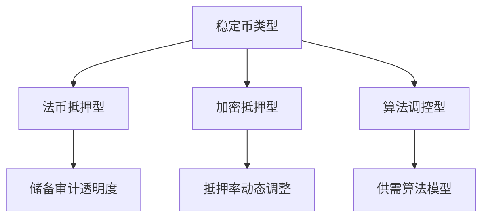

# 2025年最安全的稳定币投资指南

## 理解稳定币的核心价值

稳定币作为加密货币市场的"避风港"，通过锚定法币或资产实现价格稳定。这类数字货币既能享受区块链技术优势，又能规避极端波动风险，在交易、跨境支付和DeFi生态中占据重要地位。截至2024年9月，全球稳定币市值达1700亿美元，占整个加密市场9.45%。

👉 [深入了解稳定币投资策略](https://bit.ly/okx_welcome)

## 稳定币运作机制解析

稳定币的稳定性源于三大核心机制：

1. **法币抵押型**：以美元/黄金等资产1:1储备（如USDC）
2. **加密抵押型**：超额抵押加密资产（如DAI）
3. **算法调控型**：通过智能合约调节供需（如TerraUSD）

## 2025年三大安全标杆稳定币

### 1. USD Coin (USDC) - 合规典范

| 指标          | 数据                     |
|---------------|--------------------------|
| 市值排名      | 第2位（1350亿美元）      |
| 资产储备      | 100%美元+短期国债        |
| 审计频率      | 月度储备证明+年度审计    |
| 发行方        | Circle（获BlackRock投资）|
| 区块链安全    | 以太坊+多链部署          |

USDC凭借纽约金融服务部(NYDFS)监管框架、每月公开的储备证明报告，以及BlackRock等传统金融机构背书，成为机构投资者首选。其储备资产中短期国债占比达60%，既保证流动性又提升资产质量。

### 2. Tether (USDT) - 市场龙头

虽然市占率达70%（市值1200亿美元），但其储备结构包含约40%商业票据引发争议。2023年第四季度起推行季度储备审计，BDO意大利分所的透明度报告显示现金及等价物占比提升至85%，但仍低于USDC的100%法币储备标准。

👉 [比较主流稳定币储备结构](https://bit.ly/okx_welcome)

### 3. Dai (DAI) - 去中心化先锋

DAI的创新在于混合抵押体系：
- 43.9%中心化资产（含USDC）
- 31.5%稳定币组合
- 25%现实资产（如国债ETF）
- 24.6%以太坊质押衍生品

这种多抵押模式既降低单一资产风险，又通过25%超额抵押保障系统稳定。MakerDAO的治理机制允许社区动态调整抵押率和利率参数。

## 稳定币安全性评估体系

| 评估维度        | 关键指标                          | 权重 |
|-----------------|-----------------------------------|------|
| 监管合规性      | 牌照数量/审计机构资质             | 30%  |
| 资产透明度      | 储备证明频率/第三方审计覆盖率     | 25%  |
| 技术安全性      | 智能合约审计次数/区块链安全等级   | 20%  |
| 流动性保障      | 储备资产流动性/赎回效率           | 15%  |
| 市场接受度      | 交易所接入数/支付场景覆盖率       | 10%  |

## 投资者FAQ精选

### Q1: 如何验证稳定币的储备真实性？
A: 通过官方透明度门户查看第三方审计报告。例如USDC的[Circle透明度页面](https://circle.com/en/usdc#transparency)提供每月储备明细，而USDT的[储备报告](https://tether.to/en/transparency#reports)由BDO每季度更新。

### Q2: 哪种稳定币适合跨境支付？
A: USDC因其纽约州BitLicense牌照和SWIFT网络对接优势，在国际支付场景中更具合规优势。Visa和Mastercard已接入USDC结算网络，支持超过200个国家地区的商户。

### Q3: DAI的抵押资产风险如何管控？
A: MakerDAO采用动态风险参数调整机制：
- 实时监控抵押资产价格波动
- 设置强制平仓线（当前为135%）
- 引入保险基金应对极端行情
- 每周治理投票调整抵押率

👉 [探索稳定币风险管理方案](https://bit.ly/okx_welcome)

## 市场趋势与监管动态

2024年全球稳定币监管呈现三大趋势：
1. **储备透明化**：美国SEC要求T+1日披露储备构成
2. **发行牌照化**：欧盟MiCA法案设置100万欧元准入门槛
3. **交易实名化**：中国央行要求1000美元以上交易KYC认证

这些监管升级将重塑行业格局，预计到2025年Q2，合规成本可能淘汰30%的中小稳定币项目。

## 投资决策矩阵

| 投资者类型 | 推荐币种 | 选择理由                          |
|------------|----------|-----------------------------------|
| 保守型     | USDC     | 100%法币储备+高频审计             |
| 进取型     | DAI      | 高收益质押+去中心化治理           |
| 跨境支付   | USDT     | 全球商户覆盖率达92%               |
| 机构投资者 | USDC     | 符合ISO 20022合规标准             |

## 风险预警与防范

2024年潜在风险点：
- 美联储加息周期下商业票据违约风险（影响USDT储备质量）
- 以太坊质押收益波动（影响DAI抵押品价值）
- 各国资本管制政策差异（如中国对OTC交易的限制）

建议投资者配置比例不超过加密资产的40%，并采用"核心+卫星"策略：70%配置USDC等高流动性资产，30%配置DAI等收益型稳定币。

## 行业发展展望

2025年稳定币市场将呈现三大变革：
1. **CBDC融合**：数字美元试点将支持稳定币与央行数字货币双向兑换
2. **收益创新**：预计60%稳定币将引入浮动利率机制
3. **场景扩展**：元宇宙支付、碳交易市场等新兴场景将创造300亿美元新需求

随着OKX、Binance等平台推出稳定币收益聚合产品，2025年稳定币年化收益预期可达3.5%-5.2%，远超传统储蓄利率。

> 投资提示：稳定币虽具稳定性，但市场、监管和技术风险始终存在。建议分散持有2-3种不同机制的稳定币，并持续关注储备审计报告和监管动态。