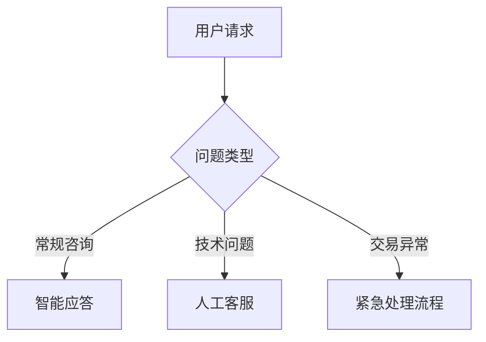

# 如何高效扩展加密货币交易所业务：实用策略解析

在数字经济浪潮下，加密货币交易所正面临前所未有的机遇与挑战。本文将深入探讨如何通过技术优化、服务升级与合规管理三大维度，构建可持续增长的交易所生态体系。

## 扩展加密货币交易所的战略价值

当前数字货币市场呈现三大特征：
- 全球用户基数年均增长率达45%
- 单日交易量峰值突破1500亿美元
- 监管框架持续完善倒逼合规升级

未能及时扩展的交易所将面临：
- 系统承载能力不足导致交易延迟
- 用户体验下降引发客源流失
- 安全防护薄弱增加运营风险
- 监管缺失带来法律隐患

## 技术架构优化方案

### 分布式数据库管理
构建高性能数据库集群需把握三个核心要素：

| 优化方向 | 实施要点 | 预期收益 |
|---------|---------|---------|
| 数据分片 | 按地域/交易类型横向切分 | 提升查询效率60% |
| 冷热分离 | 热点数据SSD存储+冷数据云归档 | 降低存储成本40% |
| 实时监控 | 部署Prometheus监控体系 | 故障响应提速3倍 |

**操作指南**：采用MongoDB分片集群+Redis缓存架构，配合自动化运维平台实现动态扩容。

### 混合云部署策略
根据业务特性选择三种部署模式：

1. **核心交易系统**：采用物理服务器集群（延迟<1ms）
2. **用户管理模块**：部署在阿里云Kubernetes容器
3. **数据分析平台**：使用AWS弹性计算资源

**技术亮点**：通过Service Mesh实现多云环境统一管理，配合CDN加速全球访问。

## 合规化运营体系

### 全球监管沙盒对比
| 司法管辖区 | 牌照类型 | 资本金要求 | 审核周期 |
|------------|----------|------------|----------|
| 新加坡 | MAS牌照 | 50万新元 | 6-8个月 |
| 日本 | FSA牌照 | 1亿日元 | 12个月 |
| 欧盟 | MiCA认证 | 35万欧元 | 9个月 |

**合规建议**：
1. 建立AML/KYC三级审核机制
2. 部署区块链交易追踪系统
3. 每季度进行第三方审计

## 产品生态构建

### 多资产交易平台设计
```markdown
1. 基础层（30%）
   - BTC/ETH等主流币种
2. 创新层（40%）
   - DeFi代币/元宇宙资产
3. 衍生品层（30%）
   - 永续合约/期权产品
```

### 智能流动性解决方案
采用做市商算法+自动化做市商（AMM）混合模式：
- 动态调整资金费率（0.01%-0.05%）
- 跨链流动性池配置（支持Solana/Polygon）
- 引入高频交易API（延迟<50ms）

## 用户体验升级

### 智能客服系统架构


### 多维数据看板
实时监控六大核心指标：
1. 系统吞吐量（TPS）
2. 订单簿深度变化
3. 用户活跃度热力图
4. 流动性池利用率
5. 安全事件响应时间
6. 合规审计进度

## 常见问题解答

👉 [如何选择适合的扩展方案？](https://bit.ly/okx_welcome)
Q：初创交易所应优先考虑哪些扩展要素？
A：建议按"技术基建(40%)→合规体系(30%)→产品矩阵(30%)"的优先级推进，初期可采用云服务+合规SaaS解决方案快速启动。

Q：扩展过程中如何保障系统稳定性？
A：实施灰度发布策略，采用A/B测试验证新功能，同时建立灾备系统（RTO<15分钟，RPO<5分钟）。

👉 [怎样平衡创新与合规？](https://bit.ly/okx_welcome)
Q：如何应对不同市场的监管差异？
A：建立模块化合规架构，针对各司法管辖区配置独立的合规组件，通过统一管理平台进行协调。

Q：扩展阶段的资金投入如何规划？
A：建议分阶段投资：
- 种子期：技术选型+基础合规（占比60%）
- 成长期：流动性建设+市场拓展（占比50%）
- 成熟期：生态布局+全球化部署（占比40%）

👉 [如何构建可持续增长模型？](https://bit.ly/okx_welcome)
Q：交易所如何实现用户留存？
A：通过三级激励体系：
1. 新手任务奖励（30%转化率）
2. 交易量分级返佣（VIP体系）
3. 持币生息计划（年化收益4-8%）

## 全球化布局路径

实施"区域中心+分布式节点"战略：
1. 在合规友好地区设立区域总部
2. 部署本地化清算节点（延迟<50ms）
3. 建立多语言服务中心（支持15种语言）

**技术支撑**：
- 分布式账本技术（吞吐量≥10万TPS）
- 跨链预言机网络
- 多币种清算系统
