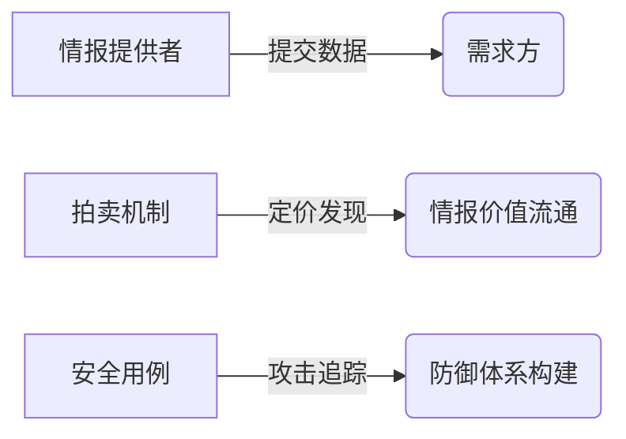

# 币安Launchpad新项目Arkham：链上情报平台发币启示录

## 核心亮点前瞻
- **首创BNB专属挖矿机制**：币安第五个Launchpad项目打破常规
- **链上情报交易革命**：全球首个P2P数据交易平台落地
- **百亿级数据赛道破局者**：对标Nansen、Dune的差异化突围
- **ARKM经济模型解析**：10亿总量背后的生态布局

👉 [解锁区块链数据分析新范式](https://bit.ly/okx_welcome)

## 项目全景透视

### 链上数据情报革命
Arkham以**链上数据情报分析平台**为定位，通过AI算法构建现实世界实体与链上地址的智能关联。其核心功能矩阵包括：

| 功能模块          | 数据维度                  | 应用场景                |
|-------------------|-------------------------|-----------------------|
| 实体交易图谱      | 跨链交易记录（按美元价值/代币分类） | 监控巨鲸资金动向        |
| 资产持仓仪表盘    | 多链资产分布（含历史盈亏）         | 机构资产配置分析        |
| 交易所行为追踪    | 存提款记录/交易对手排名           | 市场趋势预警系统        |

**差异化优势**：区别于Nansen的标签体系与Dune的SQL分析模式，Arkham首创「实体画像」系统。以孙宇晨地址监控为例，其价值11亿美元的资产中，stETH占比43%的持仓结构可实时追踪，单笔超500万美元的资金异动将触发预警机制。

### 情报交易市场深度解析
Arkham Intel Exchange平台构建了独特的**情报价值流通体系**：

**创新性突破**：
1. **匿名交易机制**：支持情报资产的OTC式流转
2. **悬赏激励系统**：需求方可通过 bounty 激活社区情报网络
3. **动态定价模型**：基于市场供需的情报价值发现

⚠️ **潜在挑战**：
- 数据时效性矛盾：大额转账监测窗口仅3-5分钟
- 道德风险防控：如何避免情报滥用与市场操纵

👉 [探索加密市场前沿应用](https://bit.ly/okx_welcome)

## 代币经济模型拆解
ARKM总量10亿枚的分配架构具有显著的战略考量：

| 分配模块   | 占比  | 锁仓机制              |
|----------|-------|---------------------|
| 项目国库 | 50%   | 动态释放（提前1个月公告） |
| 早期投资者 | 20%   | 1年锁仓+3年线性解锁   |
| 核心团队 | 20%   | 同投资者解锁节奏       |
| 做市基金 | 5%    | 流动性专项支持         |
| 生态激励 | 5%    | 用户增长计划           |

**价值捕获设计**：
- 平台服务需绑定ARKM质押
- 情报交易收取协议费用于回购
- 国库储备支持生态建设

## 赛道竞争格局

### 直接竞品对比
| 维度          | Arkham               | Nansen               | Dune               |
|--------------|----------------------|----------------------|--------------------|
| 数据模式      | 实体画像驱动         | 标签体系驱动         | SQL查询驱动        |
| 商业模式      | 情报交易市场         | 订阅制服务           | 数据可视化平台     |
| 代币作用      | 生态治理+交易媒介    | 高级功能解锁         | 无原生代币         |

**破局关键**：通过代币化实现数据资产的流动性变革，将专业分析能力转化为可交易数字资产。

## 市场影响预测

### 短期效应（0-6个月）
- **Launchpad效应**：BNB持有者参与热情或推升ARkm开盘溢价
- **数据资产化**：开启链上分析师新型变现通道
- **安全生态完善**：助力机构强化链上风控体系

### 长期价值（2-3年）
- 构建Web3.0数据交易所
- 成为机构级链上风控标准工具
- 孵化新型alpha发现模式

👉 [把握加密市场投资先机](https://bit.ly/okx_welcome)

## 常见问题解答
**Q：Arkham平台如何确保数据准确性？**  
A：采用机器学习+人工复核双重验证体系，设立数据质量评分机制，并通过代币经济模型约束虚假信息提交。

**Q：ARKM代币的实用价值体现在哪些方面？**  
A：主要包括：平台服务准入、情报交易手续费折扣、国库收益分红权、治理提案投票权四大核心权益。

**Q：情报交易市场是否存在法律风险？**  
A：平台严格遵循数据合规框架，禁止非法信息交易，所有情报必须基于公开链上数据衍生，设有三重内容审核机制。

**Q：普通用户如何参与生态建设？**  
A：可通过：1）提供高质量数据标签 2）开发智能分析模板 3）参与社区治理投票 4）构建情报交易策略等多元方式。

## 行业启示录
Arkham的创新之处在于将**链上数据价值捕获机制代币化**，这标志着区块链分析赛道进入3.0时代。其模式成功将专业级数据分析能力转化为可流通的数字资产，为行业提供三个关键启示：

1. **数据资产化范式**：开创性实现非结构化链上数据的价值流转
2. **情报经济模型**：构建生产者-消费者-平台方的价值共生体
3. **安全生态闭环**：将威胁情报纳入主动防御体系

这个发币动作本身，预示着链上数据分析从工具属性向金融基础设施的质变。正如传统金融市场的彭博终端模式，Arkham正在打造加密世界的实时链上情报操作系统。

**风险提示**：区块链数据分析存在技术迭代风险，代币投资需关注生态实际落地进展，警惕市场过度投机行为。