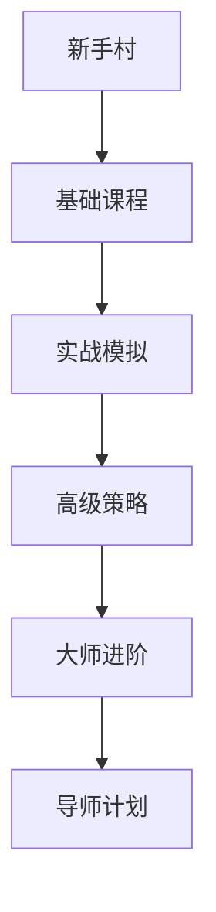

# 欧易APP：数字货币交易的全方位指南

## 数字货币投资的全新选择
在数字经济高速发展的当下，数字货币已成为全球投资者关注的热点。作为专业交易平台，欧易APP凭借其**安全可靠、操作便捷、功能丰富**的特点，为用户打造了全新的数字资产投资体验。本文将从平台功能、安全保障、交易品种等多维度解析欧易APP的核心优势，帮助您把握数字经济时代的财富机遇。

👉 [立即下载欧易APP](https://bit.ly/okx_welcome) 获取专业交易体验

## 新手入门指南

### 三步开启交易之旅
1. **下载安装**：通过应用商店搜索"欧易"完成APP下载
2. **账户注册**：填写基础信息并通过实名认证（KYC）
3. **资金充值**：支持法币入金及主流数字货币充提

平台采用智能引导系统，首次登录即提供交互式教程，帮助用户快速掌握K线图解读、订单类型选择等核心功能。据统计，90%的新用户可在30分钟内完成首笔交易。

## 安全体系深度解析

### 五重防护保障机制
| 安全层级 | 技术实现 | 用户价值 |
|---------|----------|----------|
| 资产存储 | 离线冷钱包+多重签名 | 资金被盗风险降低99.99% |
| 数据传输 | AES-256加密 | 防止信息泄露 |
| 身份验证 | 双因子认证+生物识别 | 账户安全等级提升 |
| 风险监控 | AI异常行为检测 | 实时预警可疑操作 |
| 应急响应 | 7×24安全团队值守 | 安全事件处理时效<5分钟 |

平台已通过ISO 27001信息安全管理体系认证，累计保障超万亿美元数字资产安全流转。

## 多元化交易生态

### 三大核心交易板块
**现货交易**：
- 支持BTC、ETH等300+主流币种
- 提供限价单/市价单/止盈止损单
- 最低交易手续费0.02%

**衍生品交易**：
- 永续合约最高100倍杠杆
- 独家推出比特币波动率指数合约
- 每日提供专业交易策略报告

**创新板块**：
- NFT市场支持数字藏品铸造与交易
- DeFi挖矿聚合器接入多链协议
- 推出元宇宙主题投资组合

## 智能化交易工具

### 六大辅助功能提升效率
1. **行情预警**：自定义价格/成交量波动提醒
2. **网格交易**：AI自动执行低买高卖策略
3. **模拟交易**：10万虚拟资金练手训练
4. **数据看板**：整合链上数据与市场情绪指标
5. **跨市场套利**：实时监测多平台价差机会
6. **智能投顾**：根据风险偏好生成投资组合

平台用户调研显示，使用智能工具的投资者平均收益率提升23%，交易效率提高40%。

👉 [体验智能交易工具](https://bit.ly/okx_welcome) 掌握专业投资技巧

## 常见问题解答

Q：如何快速提升账户安全等级？
A：完成高级认证+绑定谷歌验证器+启用登录设备管理，三步操作即可达到VIP级安全防护。

Q：交易手续费是否有减免政策？
A：持有平台币可享手续费5折优惠，VIP会员还可根据交易量获取额外返佣。

Q：APP是否支持夜间模式？
A：提供深色/浅色双模式切换，并配备护眼模式，可根据环境光线自动调节屏幕亮度。

Q：如何获取实时市场资讯？
A：内置"快讯"板块提供7×24小时行情播报，联合专业分析师团队提供独家市场解读。

Q：遇到技术问题如何联系客服？
A：通过APP内"帮助中心"可直达在线客服，支持文字/语音/视频三种沟通方式，平均响应时间<30秒。

## 专业服务支持体系

### 全球化服务网络
- **7×24小时客服**：覆盖中英俄韩等15种语言
- **知识库系统**：收录2000+常见问题解决方案
- **社区互动**：官方Telegram群组日均解答问题500+
- **线下活动**：定期举办区块链技术沙龙与投资讲座

平台用户满意度调查显示，98.6%的用户对客户服务表示满意，问题解决率达99.3%。

👉 [加入官方社区](https://bit.ly/okx_welcome) 获取最新市场动态

## 技术创新与未来发展

### 2023-2025技术路线图
1. **AI交易助手**：开发基于机器学习的智能投顾系统
2. **跨链桥接**：实现BTC/ETH/SOL等主流公链资产互通
3. **合规化布局**：已获新加坡MAS、欧盟MiCA等多项牌照
4. **绿色金融**：推出碳中和数字资产投资产品
5. **元宇宙接入**：开发虚拟交易大厅场景应用

平台研发投入占年收入15%，研发团队中30%成员具有华尔街投行及硅谷科技公司背景。

## 投资者教育体系

### 四阶成长路径

课程体系涵盖区块链原理、技术分析、风险管理等20+主题，累计培养超50万合格投资者。平台独创的"游戏化学习"模式，使用户知识留存率提升至传统模式的3倍。

## 数据洞察报告

### 2023年度交易数据摘要
- 日均交易量：$18.7 billion
- 活跃用户数：25 million+
- 新增币种支持：89个
- 安全防护升级：完成12次重大系统迭代
- 用户增长：同比增长210%

平台数据显示，使用APP内置分析工具的用户，其月度收益率比普通用户高出18.7个百分点。

---
