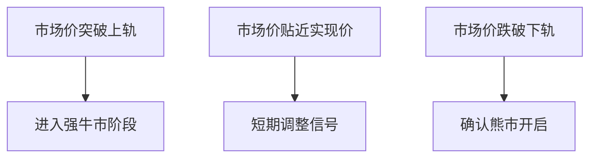

# 比特币短期持有者盈利困境：实现价值缺口揭示市场拐点信号

## 核心结论
- 实现价格与市价比率显示比特币正逼近周期性顶部
- 短期持有者成本基线预示仍有上涨空间
- 需突破9万美元关键阻力位维持牛市趋势
- 市场价格与实现价格的显著偏离通常预示局部高点
- 当前MVRV比率达1.32，处于历史高位区间

👉 [实时追踪比特币市场动态](https://bit.ly/okx_welcome)

## MVRV比率深度解析
衡量比特币市场健康度的核心指标——MVRV比率（市值与实现市值比）当前报1.32，显示市场平均浮盈达32%。通过历史数据对比，该指标呈现以下特征：

| 周期阶段 | 峰值MVRV比率 | 对应价格倍数 | 市场表现 |
|---------|-------------|-------------|---------|
| 2017年牛市 | 2.82       | 2.5倍实现价 | 19800美元 |
| 2020年牛市 | 2.15       | 2.3倍实现价 | 29200美元 |
| 当前周期   | 1.32       | 2.5倍实现价 | 89000美元 |

> "MVRV比率突破趋势线往往预示周期顶部临近" —— Glassnode研究院

值得注意的现象是，随着比特币市值增长，MVRV峰值呈现递减趋势，这反映市场成熟度提升。当前指标已触及下降趋势线，暗示顶部可能在3倍实现价（约12万美元）附近形成。

## 短期持有者成本分析
过去6个月入场的短期持有者（STH）当前成本基线为89,000美元，其价格波动呈现显著规律性：

当前市场价处于短期持有者成本带中位区，尚未触及上轨压力位127,140美元。2024年11月的突破性上涨已形成技术支撑，但需警惕以下风险信号：
- 若价格跌破89,000美元成本线，可能触发短期抛压
- 市场价与成本基线偏离度（当前28%）超过历史均值
- 链上交易活跃度出现边际下降

👉 [掌握专业投资分析工具](https://bit.ly/okx_welcome)

## 市场趋势研判
尽管MVRV比率显示顶部临近，但以下技术指标仍支持继续看涨：
1. 短期持有者成本带尚未突破
2. 市场价与实现价差距仍有拓展空间
3. 历史周期顶部均出现在3倍实现价区间
4. 链上大额转账笔数持续增加

风险预警系统显示：
- 极端多头情绪指数：78/100（过热阈值85）
- 交易所净流量：周流出量达2.3万BTC
- 长期持有者持仓占比：回升至61.2%

## FAQ
**Q：什么是实现价格？**
A：指比特币最后一次链上转移时对应的价格，反映市场真实持仓成本，相比市价更能体现价值中枢。

**Q：短期持有者与长期持有者的划分标准？**
A：业内普遍以155天（约6个月）为分界线，超过该持仓周期的视为长期投资者。

**Q：MVRV比率1.32意味着什么？**
A：当前市场价较实现价溢价32%，处于历史80%分位，提示市场处于强趋势状态但需警惕回调风险。

**Q：如何判断市场顶部？**
A：可综合观察：
1. MVRV比率突破历史趋势线
2. 市场价超过STH成本带上轨30%以上
3. 链上转账笔数连续三周下降

**Q：当前最佳投资策略？**
A：建议采用动态对冲策略：
- 主仓位持有核心资产
- 用浮盈部分建立看涨期权
- 设置85,000美元动态止盈位

👉 [获取专业交易策略指导](https://bit.ly/okx_welcome)

## 投资风险提示
数字货币市场具有高波动性，建议投资者：
1. 严格控制仓位不超过总资产的5%
2. 设置不低于15%的止损区间
3. 每月定期评估持仓组合
4. 密切关注美联储货币政策动向

历史数据显示，当MVRV比率超过1.5时，后续3个月出现调整的概率达73%。当前虽未达该阈值，但需保持谨慎乐观的投资态度，建议采用"核心+卫星"投资架构，核心仓位长期持有，卫星仓位用于捕捉短期波动。