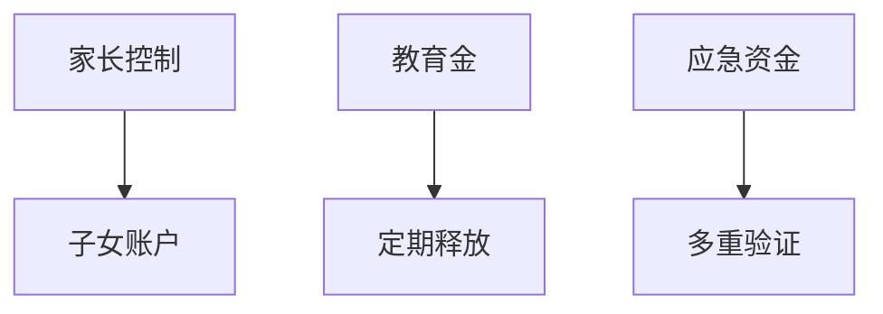
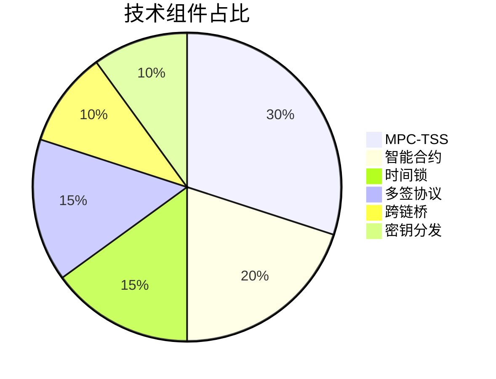

# 用去中心化技术守护数字资产安全：Mixin解决方案全解析

## 去中心化：加密货币的立身之本

"不是你的私钥，就不是你的币"这句加密圈名言，道出了数字资产管理的核心准则。2008年金融危机催生的比特币，正是通过去中心化技术彻底颠覆了传统金融体系。Mixin作为新一代数字资产管理平台，始终恪守这一基本原则，通过多重创新技术构建起安全可靠的资产守护体系。

👉 [立即体验专业级资产托管服务](https://bit.ly/okx_welcome)

## 中心化机构的风险警示

回顾加密货币发展史，中心化交易所被盗事件屡见不鲜：
- 2014年Mt.Gox交易所丢失85万比特币
- 2019年Binance被盗7000比特币
- 2022年FTX交易所破产引发连锁反应

这些案例印证了中心化托管模式的根本性缺陷：单点故障、透明度缺失、资产控制权旁落。Mixin通过去中心化架构彻底规避这些风险，真正实现"我的资产我做主"。

## 核心技术架构解析

### 分布式密钥管理系统（DKMS）
采用军用级加密算法，将私钥分片存储于多个节点：
| 技术维度 | 传统模式 | Mixin方案 |
|---------|----------|-----------|
| 密钥存储 | 单点保管 | 多节点分片 |
| 恢复机制 | 备份助记词 | 社交化恢复 |
| 访问控制 | 单一权限 | 多重签名 |

### 智能合约安全层
通过可验证的开源代码实现：
- 资金流向透明可查
- 防止恶意代码注入
- 自动执行交易规则

### 时间锁技术应用
设置双重保障机制：
1. 交易确认缓冲期（可配置0-48小时）
2. 异常交易熔断机制
3. 多签审批流程

## 创新性解决方案矩阵

### 多方安全计算（MPC-TSS）
突破性地将门限签名技术（TSS）与多方计算结合：
- 私钥永不暴露于任何单一节点
- 支持分布式签名验证
- 实现无缝的跨链资产管理

### 信任群组（MTG）协议
构建去中心化治理网络：
- 支持1-of-3至5-of-9多种签名方案
- 动态权限管理
- 离线签名验证通道

👉 [了解更多安全技术细节](https://bit.ly/okx_welcome)

## 家庭/企业级资产管理方案

### 家庭金库模式
通过安全沙盒技术实现：

### 企业级多签架构
支持定制化权限配置：
- 董事会级审批（5/7签名）
- 部门预算管理（1/3授权）
- 审计追踪系统

## 安全审计与验证机制

### 三重验证体系
1. 链上数据验证（区块浏览器直连）
2. 零知识证明（ZKP）技术
3. 开源代码审计（GitHub实时更新）

### 容灾备份方案
构建分布式节点网络：
- 地理位置分散的验证节点
- 热-温-冷存储分层机制
- 自动化的故障转移系统

## 常见问题解答

### Q：如何确保密钥分片的安全性？
A：采用Shamir秘密共享算法，任何单一分片都无实际意义，至少需要设定数量的分片组合才能还原私钥，且每次使用后自动更新分片数据。

### Q：相比传统硬件钱包有何优势？
A：硬件钱包存在物理损毁风险，而我们的分布式存储方案可实现自动冗余备份，且支持社交化恢复机制，无需依赖物理设备。

### Q：私钥丢失后能否找回？
A：通过预先设置的恢复协议，可借助可信联系人网络进行密钥重建，整个过程在加密通道中完成，确保资产安全。

### Q：如何防范内部人员作恶？
A：系统采用代码即法律的设计理念，所有操作必须通过智能合约执行，团队成员无法接触底层私钥，完全杜绝监守自盗的可能性。

👉 [获取企业级安全方案白皮书](https://bit.ly/okx_welcome)

## 技术生态全景图

构建完整的去中心化技术栈：

通过这种模块化架构设计，用户可灵活组合不同安全组件，构建符合自身需求的定制化解决方案。

## 行业发展趋势

根据Gartner 2024年技术成熟度曲线：
- 去中心化身份认证（DID）预计2026年进入主流应用
- MPC钱包技术已跨越概念验证阶段
- 智能合约审计工具进入快速增长期

Mixin持续投入研发创新：
- 每月更新安全协议库
- 季度发布技术白皮书
- 年度举办全球安全峰会

通过将尖端密码学成果与工程实践相结合，我们致力于打造数字资产管理的黄金标准。在保障资产安全的同时，通过人性化设计降低使用门槛，让每个人都能轻松掌控自己的数字未来。